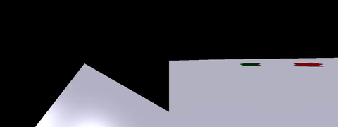
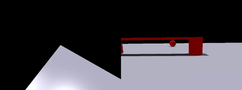
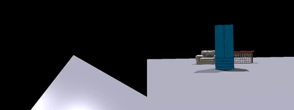
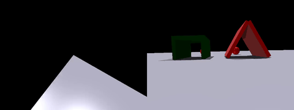
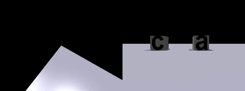

# MMTVLA

This repository provides the QUARD-CoT dataset and validation videos of MMTVLA in both simulation environments and on the Unitree Go2 real robot, and the MMTVLA code will be released soon.

QUARD-CoT Dataset: https://huggingface.co/datasets/cenzl/QUARD_CoT

# Simulation Video

# Sim2Real Video

We evaluate MMTVLA in real-world scenarios using the Unitree Go2 quadruped robot platform and the official sdk.

### Go to a position in front of the red ball.

### Recognize the letter B and walk to the sign displaying the letter B.

### Go through the square passage.

### Go through the triangular passage.

### Avoid the chair and locate the green sphere, then move toward it.

### Unload the item into the yellow tray.

